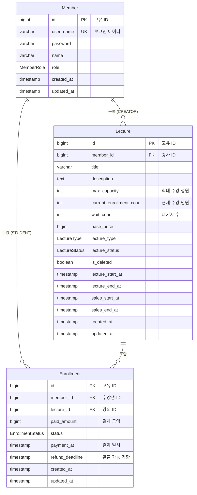

# 라이브클래스 코딩 과제

## 프로젝트 개요
### 과제 [BE-A]
크리에이터(강사)와 수강생를 연결해주는 강의 개설 및 수강 신청 시스템입니다. </br>
강의 생성, 상태 관리, 결제 및 수강 취소 흐름을 포함하며, 정원 초과 시 자동으로 대기열(Waitlist)로 빠지는 시스템과 취소 발생 시 대기자를 승격시키는 등 비즈니스 로직을 구현하는 데 집중했습니다.

---

## 기술 스택
- **언어**: Java 21
- **프레임워크**: Spring Boot 3.x
- **데이터베이스, ORM**: H2, Spring Data JPA (Hibernate)
- **문서화**: Swagger
- **빌드 도구**: Gradle

---

## 실행 방법
### 로컬 실행
1. 프로젝트를 클론하거나 다운로드합니다.</br></br>
2. 터미널에서 프로젝트 최상단 경로로 이동합니다.</br></br>
3. 아래 명령어를 통해 프로젝트를 빌드하고 실행합니다.</br></br>
   ```bash
   # Windows (Powershell)
   ./gradlew.bat bootRun

   # Mac/Linux
   ./gradlew bootRun
   ```
4. 실행 후 브라우저에서 아래 주소로 접속하여 API 문서(Swagger UI)를 확인할 수 있습니다.
   - **Swagger UI**: [http://localhost:8080/swagger-ui/index.html](http://localhost:8080/swagger-ui/index.html)</br></br>
5. 로그인 계정(별도로 회원가입 후 테스트해도 무방합니다.)
   - 강사 계정 : creator01 / 1234
   - 수강자 계정 : student01 / 1234

---

## 요구사항 해석 및 가정
1. **강의 상태 관리**:
   - 강의는 `DRAFT(초안)` -> `OPEN(모집 중)` -> `CLOSED(마감)` 상태를 가집니다. `DRAFT`와 `CLOSED` 상태에서는 신청이 불가합니다.
   - 강사가 업로드한 본인의 강의 목록 조회는 페이지네이션을 적용했으며, 상태에 따라 필터링이 가능합니다.
   - 강의 상세보기에서 현재 신청 인원 목록을 페이지네이션을 적용했으며, 대기 인원 수를 조회할 수 있습니다.
   - 대기 인원이 있는 상태에서 강의 정원을 늘리게 되면 늘린 숫자만큼 대기 인원이 신청인원으로 승격됩니다.</br></br>
2. **수강 신청 프로세스**: 
   - 사용자가 신청하면 즉시 정원 한자리를 선점하고 **`PENDING(결제 대기)`** 상태가 됩니다.
   - 정원이 가득 찬 경우 거부되는 대신, **`WAITLISTED(대기열)`** 상태로 등록되어 취소자 발생 시 승격할 기회를 얻습니다.
   - 결제 진행 시 **`CONFIRMED(수강 확정)`** 상태로 변경됩니다. 결제 모듈은 실제 PG 연동 대신 파라미터 검증 로직으로 간소화했습니다.</br></br>
3. **취소 및 환불 정책**: 
   - `CONFIRMED` 상태 진입(결제 확정) 후 7일 이내에만 취소(환불)가 가능하도록 정책을 가정했습니다. (`refundDeadline` 도입)</br></br>
4. **자동 취소 스케줄러**: 결제 대기(`PENDING`) 상태로 3일이 경과한 데이터는 주기적으로 실행되는 스케줄러를 통해 자동으로 취소 처리되며, 정원을 복구하고 대기자를 승격시킵니다.</br></br>
5. **인증/인가**: 제약사항을 고려하여 세션의 `userName` 파라미터를 통한 간단한 검증 로직으로 사용자를 식별하도록 가정했습니다.

---

## 설계 결정과 이유

1. **데이터 무결성을 위한 날짜 자동 보정 시스템**
   - 수강 신청 시스템에는 `판매 시작/종료`, `강의 시작/종료` 등 여러 날짜가 얽혀 있습니다. 만약 관리자의 실수로 강의가 끝난 뒤에 판매가 시작되거나, 종료일이 시작일보다 앞서는 데이터가 들어오면 시스템 전체의 예약 로직이 오작동하게 됩니다.
   - 강의를 오픈하기전에 날짜를 검사하여 예외를 발생시킵니다. 규칙은 아래와 같습니다.
     - `판매 시작일`은 `강의 시작일` 이전이어야 함
     - `판매 시작일`은 `판매 종료일` 이전이어야 함
     - `강의 시작일`은 `강의 종료일` 이전이어야 함
   - 강의가 무료일 경우, 상시 판매 및 수강이 가능할 경우를 위해 날짜는 null을 허용하지만, 경우에 따라 꼭 있어야할 일자는 자동으로 보정되어 들어갑니다.
     - `강의 시작일`이 `null`일 경우 -> `강의 시작일`은 현재 시각으로 저장
     - `강의 종료일`이 `null`이 아니면서, `판매 종료일`이 `null`이거나 `판매 종료일`이 `강의 종료일`보다 이후일 경우 -> `판매 종료일`을 `강의 종료일`로 저장</br></br>
2. **대기열 승격 시스템**
   - 대기열 시스템을 구현하기로 하면서 대기열 등록 후 자리가 생겼을 때 사용자에게 어떤 방식으로 전달할지 고민하였습니다.
   - 대기열은 단순 알람 신청이 아닌 순서가 의미가 있는 시스템이라고 생각하여 알람은 단순 서버 로그로 대체한 뒤, 자동으로 신청(`PENDING`) 상태로 승격되도록 구현하였습니다.
   - 또한 대기열이 있는 상태에서 정원을 수정할 경우 늘어난 정원만큼 대기자가 신청 상태로 승격됩니다.</br></br>
3. **동시성 이슈 해결 방안 (원자적 업데이트)**
   - 수십 명의 사용자가 남은 한 자리에 동시에 수강 신청을 하는 상황을 방어해야 했습니다.
   - 비관적 락이나 낙관적 락을 사용할 경우 성능 저하 문제나 재시도 로직 구현의 복잡성이 커지는 단점이 있고, 시스템 특성상 트래픽이 한순간에 과도하게 몰리지 않을 것같다는 판단하에 DB의 기본 락 메커니즘을 이용한 원자적 업데이트 쿼리를 채택했습니다.
   - 쿼리로 직접 조회와 수정을 하나로 묶어 1건만 업데이트되도록 보장함으로써 동시성 문제를 효율적이고 안전하게 해결했습니다.


---

## 미구현 / 제약사항
- 회원가입시 별도의 암호화를 거치지 않고 저장하며, session 로그인으로 대체합니다.
- 외부 결제 시스템(PG사)과의 실제 연동 로직은 포함되어 있지 않습니다.
- 대기자 자동 승격 시 사용자에게 푸시 알림이나 이메일을 발송하는 기능은 미구현 상태이고, 서버 출력 로그로 대체했습니다.

---

## AI 활용 범위
- **아키텍처 및 도메인 설계**: 직접 계획과 설계 후 놓친 부분과 피드백을 위해 사용하였습니다.
- **API 개발**: 모르는 것이 있을 때 사용, 주로 초안 제작 요청 후 해당 코드 재활용하여 사용하였습니다.
- **검증 및 피드백**: 각 구현 단계 종료 후에 AI 에이전트를 활용하여 로직의 정합성을 검증하고, 도출된 피드백을 바탕으로 시스템을 고도화하였습니다.

---

## API 목록 및 예시
프로젝트 실행 후 **Swagger UI**를 통해 모든 API를 테스트하고 명세를 확인할 수 있습니다.
- `http://localhost:8080/swagger-ui/index.html`

### 주요 API 요약
- **[POST]** `/api/creator` : 강의 생성 (CREATOR 권한 필요)
- **[PUT]** `/api/creator/{lectureId}` : 강의 정원 및 정보 수정 (대기자 자동 승격 로직 포함)
- **[POST]** `/api/enrollment/{lectureId}/subscribe` : 수강 신청 (오픈된 강의에 한함, 정원 초과 시 대기열 전환)
- **[POST]** `/api/enrollment/{enrollmentId}/confirm` : 수강료 결제 (PENDING -> CONFIRMED)
- **[PATCH]** `/api/enrollment/{enrollmentId}/cancel` : 수강 취소 (환불 기간 체크 후 취소 및 대기자 승격)

---

## 데이터 모델 설명 (DB ERD 개념도)

### ERD



### 테이블 설명

#### Member
| 컬럼 | 타입 | 설명 |
|------|------|------|
| id | bigint | 고유 ID (PK) |
| user_name | varchar | 로그인 아이디 (unique) |
| password | varchar | 비밀번호 |
| name | varchar | 이름 |
| role | MemberRole | STUDENT / CREATOR |
| created_at | timestamp | 생성 일시 |
| updated_at | timestamp | 수정 일시 |

#### Lecture
| 컬럼 | 타입 | 설명 |
|------|------|------|
| id | bigint | 고유 ID (PK) |
| member_id | bigint | 강사 ID (FK → Member.id) |
| title | varchar | 강의 제목 |
| description | text | 강의 설명 |
| max_capacity | int | 최대 수강 정원 |
| current_enrollment_count | int | 현재 수강 인원 |
| wait_count | int | 현재 대기자 수 |
| base_price | bigint | 수강료 |
| lecture_type | LectureType | LIVE / VOD |
| lecture_status | LectureStatus | DRAFT → OPEN → CLOSED |
| is_deleted | boolean | 소프트 삭제 여부 |
| lecture_start_at | timestamp | 강의 시작일 |
| lecture_end_at | timestamp | 강의 종료일 |
| sales_start_at | timestamp | 판매 시작일 |
| sales_end_at | timestamp | 판매 종료일 |
| created_at | timestamp | 생성 일시 |
| updated_at | timestamp | 수정 일시 |

#### Enrollment
| 컬럼 | 타입 | 설명 |
|------|------|------|
| id | bigint | 고유 ID (PK) |
| member_id | bigint | 수강생 ID (FK → Member.id) |
| lecture_id | bigint | 강의 ID (FK → Lecture.id) |
| paid_amount | bigint | 결제 금액 (PENDING / WAITLISTED 시 NULL) |
| status | EnrollmentStatus | 수강 신청 상태 |
| payment_at | timestamp | 결제 일시 (PENDING / WAITLISTED 시 NULL) |
| refund_deadline | timestamp | 환불 가능 기한 (결제일 + 7일, PENDING / WAITLISTED 시 NULL) |
| created_at | timestamp | 생성 일시 |
| updated_at | timestamp | 수정 일시 |

---

## 테스트 실행 방법

```bash
# 터미널에서 아래 명령어를 실행하여 전체 테스트를 수행합니다.
./gradlew clean test
```
- 실행 완료 후 `build/reports/tests/test/index.html` 파일을 브라우저로 열면 직관적인 테스트 리포트를 확인할 수 있습니다.
